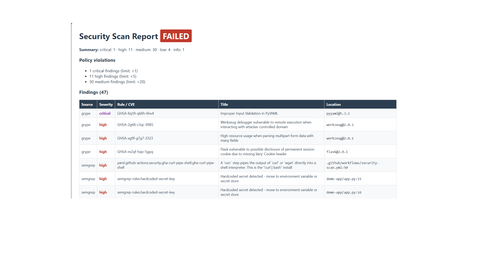

AppSec CI/CD Pipeline

An automated application-security pipeline that embeds SAST, SBOM generation, dependency scanning, and DAST into GitHub Actions — unified by a Python policy gate that normalizes findings from every scanner and fails the build when severity thresholds are exceeded.
> The failing ❌ Security Policy Gate in the Actions tab is intentional: the pipeline scans a deliberately vulnerable demo app and correctly blocks it. That red X is the feature.
How it works
```
                      push / pull request
                             │
        ┌────────────────────┼────────────────────┐
        ▼                    ▼                    ▼
   SAST (Semgrep)      SBOM + SCA            DAST (OWASP ZAP)
   • OWASP Top 10      • Syft → CycloneDX    • boots demo app in CI
   • secrets rules       SBOM                • baseline scan over
   • 5 custom rules    • Grype → CVE           live HTTP
     (see below)         matching
        │                    │                    │
        └───────► reports/*.json (artifacts) ◄────┘
                             │
                             ▼
              Security Policy Gate  (orchestrator/gate.py)
              • ingest Semgrep / Grype / ZAP JSON
              • normalize severities to one scale
              • apply security-policy.yml thresholds
              • emit findings.json + report.html
              • exit 1 → build fails on violation
```
Latest pipeline result (real run)

```
[gate] grype.json:   16 findings     (known CVEs in pinned dependencies)
[gate] semgrep.json: 27 findings     (SAST: injection, secrets, crypto)
[gate] zap.json:      4 findings     (runtime: XSS, missing headers)

[gate] 47 findings (0 suppressed by policy)
[gate]   critical: 1 | high: 11 | medium: 30 | low: 4 | info: 1

[gate] POLICY VIOLATIONS — failing build:
[gate]   ✗ 1 critical findings (limit: <1)
[gate]   ✗ 11 high findings (limit: <5)
[gate]   ✗ 30 medium findings (limit: <20)
Error: Process completed with exit code 1.
```
Defense-in-depth in action: the reflected XSS in `/greet` is caught twice —
statically by a custom Semgrep rule, and again at runtime by ZAP against the
running app. GitHub push protection also flagged the planted secret on upload:
three independent layers detecting planted flaws.
Custom Semgrep rules
Beyond the standard `p/owasp-top-ten`, `p/secrets`, and `p/security-audit`
packs, `semgrep-rules/custom.yml` adds five hand-written rules mapped to OWASP
categories:
Rule	Detects	OWASP
`sqli-string-concat`	user input concatenated into SQL	A03: Injection
`xss-render-template-string-concat`	request data rendered unsanitized	A03: Injection
`weak-hash-md5-password`	MD5 password hashing	A02: Crypto Failures
`hardcoded-secret-key`	secrets committed in source	A05: Misconfig
`flask-debug-enabled`	Werkzeug debugger RCE exposure	A05: Misconfig
The demo app (scan target)
`demo-app/` is a small Flask service with labeled, intentional flaws so
every scanner has verifiable ground truth: SQL injection, reflected XSS,
hardcoded secrets, MD5 password hashing, debug mode, and dependencies pinned
to versions with known CVEs (Flask 2.0.1, PyYAML 5.3.1, ...).
⚠️ Never deploy this app anywhere. It exists to be scanned.
Policy as code
`security-policy.yml` defines the gate:
```yaml
fail_on:
  critical: 1     # any critical fails the build
  high: 5
  medium: 20
ignore:
  # suppress by rule id, reason required — auditable exceptions
  # - id: python.lang.security.audit.debug-enabled
  #   reason: "demo only, tracked in issue #12"
```
Suppressions require a written reason, keeping every exception auditable.
Repository layout
```
demo-app/                     vulnerable Flask scan target
orchestrator/gate.py          findings aggregator + policy gate
semgrep-rules/custom.yml      custom OWASP-mapped SAST rules
security-policy.yml           severity thresholds + suppressions
.github/workflows/            the pipeline (sast / sbom / dast / gate)
```
Run the gate locally
```bash
pip install semgrep pyyaml
semgrep scan --config semgrep-rules/custom.yml demo-app/ \
  --json --output reports/semgrep.json
python orchestrator/gate.py --policy security-policy.yml --reports reports/
```
Roadmap
[x] Vulnerable demo app with labeled flaws
[x] SAST — Semgrep + custom rules
[x] SBOM — Syft (CycloneDX) + Grype CVE matching
[x] Python policy gate with JSON/HTML reporting
[x] DAST — OWASP ZAP baseline against the live app in CI
[ ] Auto-create GitHub issues for new findings
[ ] PR comments with finding diffs
